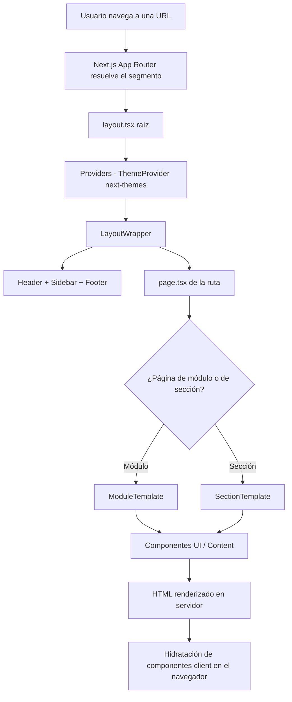

# Arquitectura del Proyecto

> Portal de Inducción para Personal de Salud — aplicación web educativa construida con **Next.js 16 (App Router)**, **React 19**, **TypeScript 5** y **Tailwind CSS v4**.

## 1. Estructura de carpetas

Árbol simplificado del proyecto (se omiten `node_modules`, `.next` y archivos generados):

```
induccion-salud/
├── eslint.config.mjs          # Configuración de ESLint (flat config)
├── next.config.ts             # Configuración de Next.js
├── next-env.d.ts              # Tipos generados por Next.js
├── package.json               # Dependencias y scripts
├── postcss.config.mjs         # Plugin de Tailwind para PostCSS
├── tsconfig.json              # Configuración de TypeScript + alias @/*
├── public/
│   └── images/                # Recursos estáticos
└── src/
    ├── app/                   # App Router (rutas, layouts, páginas)
    │   ├── globals.css        # Estilos globales + tema Tailwind
    │   ├── layout.tsx         # Layout raíz (html, providers, wrapper)
    │   ├── page.tsx           # Página de inicio
    │   ├── providers.tsx      # Proveedor de tema (next-themes)
    │   ├── capacitaciones/    # Módulo: capacitaciones (aps, hospital, ihce, mipres, xenco)
    │   ├── facturacion-pyp/   # Módulo: facturación de servicios P&P
    │   ├── historias-clinicas/# Módulo: diligenciamiento de historias clínicas
    │   ├── seguridad-informacion/   # Módulo: seguridad de la información
    │   ├── vigilancia-epidemiologica/ # Módulo: vigilancia epidemiológica
    │   └── demo/              # Página de demostración de componentes
    ├── components/
    │   ├── content/           # Bloques de contenido (ContentBlock, SectionIntro)
    │   ├── layout/            # Estructura visual (Header, Footer, Sidebar, etc.)
    │   ├── templates/         # Plantillas de página (ModuleTemplate, SectionTemplate)
    │   └── ui/                # Componentes de interfaz reutilizables
    ├── data/
    │   └── navigation.ts      # Definición declarativa de la navegación
    ├── hooks/
    │   └── useSidebarState.ts # Estado del sidebar con persistencia
    └── lib/
        └── utils.ts           # Utilidad cn() para componer clases
```

## 2. Patrón arquitectónico

El proyecto sigue una arquitectura **monolítica de frontend basada en componentes**, propia de Next.js con **App Router**. No es una arquitectura por capas tradicional (MVC / Clean / Hexagonal), sino una organización por **responsabilidad de UI** con separación clara entre:

- **Rutas y páginas** (`src/app/`): cada carpeta es un segmento de ruta con su `page.tsx`.
- **Plantillas** (`src/components/templates/`): estructuras de página reutilizables que estandarizan el layout de módulos y secciones.
- **Componentes de presentación** (`src/components/ui/` y `src/components/content/`): piezas reutilizables sin lógica de negocio.
- **Datos de configuración** (`src/data/`): la navegación se define de forma declarativa y centralizada.

**Justificación:** al tratarse de un portal de contenido educativo (principalmente estático e informativo), el patrón de composición por componentes con plantillas reutilizables maximiza la consistencia visual y minimiza la duplicación. La mayoría de páginas son **React Server Components** por defecto; solo los componentes interactivos se marcan con `'use client'`.

## 3. Capas / módulos principales y responsabilidades

| Módulo | Ubicación | Responsabilidad |
|--------|-----------|-----------------|
| **Layout** | `src/components/layout/` | Estructura global: `Header`, `Footer`, `Sidebar`, `LayoutWrapper`, `ThemeToggle`, `ArticleContainer`, `SectionBackground`. |
| **Templates** | `src/components/templates/` | `ModuleTemplate` (página índice de módulo con tarjetas de subsecciones) y `SectionTemplate` (página de contenido con breadcrumbs y navegación previa/siguiente). |
| **UI** | `src/components/ui/` | Componentes reutilizables: `Card`, `Alert`, `Button`, `Accordion`, `Quiz`, `Badge`, `Breadcrumbs`, `PageNavigation`, `VideoEmbed`, `ImageGallery`, `ModuleCard`, `CopyButton`, `ProgressIndicator`, etc. |
| **Content** | `src/components/content/` | `ContentBlock` y `SectionIntro` para encabezados y bloques de contenido educativo. |
| **Data** | `src/data/navigation.ts` | Fuente única de verdad de la jerarquía de navegación (módulos y subsecciones). |
| **Hooks** | `src/hooks/` | `useSidebarState` para gestionar expansión/colapso y persistencia del sidebar. |
| **Lib** | `src/lib/utils.ts` | Helper `cn()` (combinación de `clsx` + `tailwind-merge`). |

## 4. Flujo de una request típica



1. El usuario solicita una ruta (por ejemplo `/seguridad-informacion/manejo-equipos`).
2. El **App Router** localiza el `page.tsx` correspondiente al segmento.
3. Se aplica el **layout raíz** ([src/app/layout.tsx](../../src/app/layout.tsx)), que envuelve la app con `Providers` (tema) y `LayoutWrapper` (header, sidebar, footer).
4. La página usa una **plantilla** (`ModuleTemplate` o `SectionTemplate`) que compone componentes de `ui` y `content`.
5. Next.js renderiza el HTML en el servidor; los componentes marcados con `'use client'` (sidebar, quiz, toggle de tema, etc.) se hidratan en el cliente.

## 5. Tecnologías y librerías clave

| Tecnología | Propósito arquitectónico |
|------------|--------------------------|
| **Next.js 16** (App Router) | Framework de renderizado (Server Components), enrutamiento basado en sistema de archivos y optimizaciones de build. |
| **React 19** | Librería base de UI y modelo de componentes. |
| **TypeScript 5** | Tipado estático en todo el código; alias `@/*` → `src/*`. |
| **Tailwind CSS v4** | Sistema de estilos utility-first; tema personalizado definido en `globals.css` con `@theme`. |
| **framer-motion** | Animaciones del sidebar, drawers móviles y transiciones de acordeones. |
| **next-themes** | Gestión de tema claro/oscuro con detección de preferencia del sistema. |
| **lucide-react** | Iconografía vectorial usada en navegación y tarjetas. |
| **clsx + tailwind-merge** | Composición segura de clases CSS mediante el helper `cn()`. |

## 6. Manejo de estado

No se utiliza una librería global de estado (Redux, Zustand, etc.). El estado es **local y acotado**:

- **Tema:** gestionado por `next-themes` mediante `ThemeProvider` en [src/app/providers.tsx](../../src/app/providers.tsx), con persistencia automática y atributo `class`.
- **Sidebar:** el hook [useSidebarState](../../src/hooks/useSidebarState.ts) maneja expansión/colapso, apertura móvil y secciones expandidas, **persistiendo en `localStorage`** (`sidebar-expanded` y `sidebar-expanded-sections`).
- **Componentes interactivos:** componentes como `Quiz` mantienen su propio estado con `useState`.

## 7. Estrategia de acceso a datos

La aplicación **no consume una base de datos ni una API externa**. El contenido es estático y se define directamente en el código:

- La **navegación** se declara en [src/data/navigation.ts](../../src/data/navigation.ts) como un array tipado (`NavItem[]`).
- El **contenido educativo** (textos, FAQs, quizzes) está embebido en los propios `page.tsx` de cada sección como JSX.

> *No se encontró evidencia de ORM, repositorios, queries directas ni integración con APIs externas en el proyecto.*
